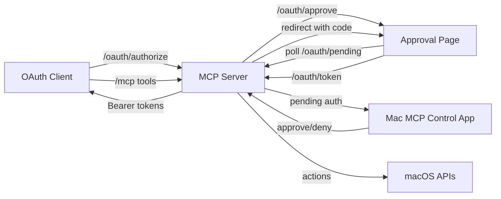
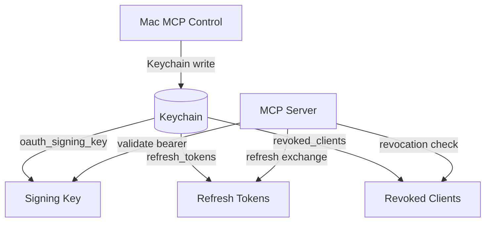

# Mac MCP Control

Mac MCP Control is a macOS menubar app that turns a Mac into a local, user‑approved control server. It exposes MCP over HTTP, gates access through in‑app OAuth approval, and executes actions through native macOS APIs. It is built for real workflows: local automation, remote control via ngrok when needed, and clear session management.

> **Disclaimer:** Remote control of your Mac carries inherent risks. By using this software, you accept full responsibility for actions taken with it. The author is not liable for damages, data loss, or security incidents.

## What It Does

- Hosts an MCP server on your Mac (default port 7519).
- Uses OAuth 2.0 + PKCE; approvals happen only inside the app.
- Executes actions: mouse, keyboard, screenshots, scroll, and shell commands.
- Manages sessions with revocation and live activity tracking.
- Optionally tunnels public access through ngrok.

## Requirements

- macOS 14.0+
- Xcode Command Line Tools (for building from source)

## Install

### Releases

Download the latest build from the [Releases page](https://github.com/michaellatman/MacMCPControl/releases).

### Build from Source

```bash
git clone https://github.com/michaellatman/MacMCPControl.git
cd MacMCPControl
./scripts/build.sh
open MacMCPControl.app
```

## First Launch

You will be prompted for:
1. **Accessibility** (mouse/keyboard control)
2. **Screen Recording** (screenshots)
3. **Terms Acceptance**

After onboarding, the server starts automatically.

## Configuration

Settings are accessible from the menubar (Cmd+,):

- **Device Name** — label for this Mac
- **MCP Port** — default 7519
- **Enable ngrok tunnel** — public URL when needed
- **Ngrok Token** — optional auth token

Sessions tab shows active authorizations. You can rename, revoke selected, or revoke all.

## MCP Endpoints

- Local: `http://localhost:7519/mcp`
- Public (ngrok): `https://<subdomain>.ngrok.app/mcp`
- Discovery:
  - `/.well-known/oauth-authorization-server`
  - `/.well-known/oauth-protected-resource`

## Security Model

- OAuth approvals are in‑app only; the browser cannot grant access.
- Short‑lived access tokens, refresh tokens per client.
- Revocation is immediate; “revoke all” rotates the signing key.
- OAuth signing key, refresh tokens, and revoked clients are stored in macOS Keychain.
- If you enable ngrok, treat the URL as sensitive and revoke when done.

## Architecture





## License

See `LICENSE`.
