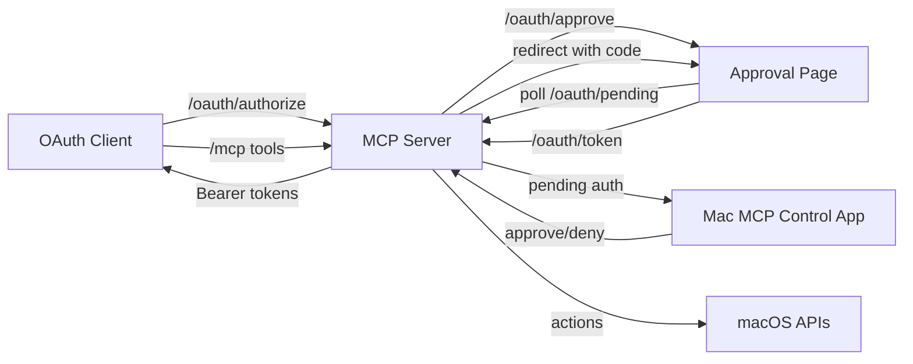
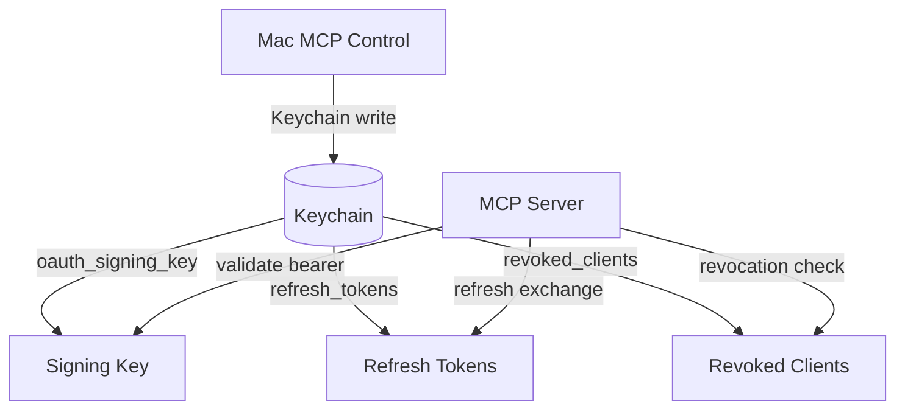

# Mac MCP Control

Mac MCP Control is a macOS menubar app that turns a Mac into a local, user‑approved control server. It exposes MCP over HTTP, gates access through in‑app OAuth approval, and executes actions through native macOS APIs. It is built for real workflows: local automation, remote control via ngrok when needed, and clear session management.

> **Disclaimer:** Remote control of your Mac carries inherent risks. By using this software, you accept full responsibility for actions taken with it. The author is not liable for damages, data loss, or security incidents.

## What It Does

- Hosts an MCP server on your Mac (default port 7519).
- Uses OAuth 2.0 + S256 PKCE; approvals happen only inside the app.
- Executes actions: mouse, keyboard, screenshots, scroll, and shell commands.
- Manages sessions with revocation and live activity tracking.
- Optionally tunnels public access through ngrok.

## Requirements

- macOS 14.0+
- Xcode Command Line Tools (for building from source)

## Install

### Releases

Download the latest build from the [Releases page](https://github.com/michaellatman/MacMCPControl/releases).

### Build from Source

```bash
git clone https://github.com/michaellatman/MacMCPControl.git
cd MacMCPControl
./scripts/build.sh
open MacMCPControl.app
```

## First Launch

You will be prompted for:
1. **Accessibility** (mouse/keyboard control)
2. **Screen Recording** (screenshots)
3. **Terms Acceptance**

After onboarding, the server starts automatically.

## Configuration

Settings are accessible from the menubar (Cmd+,):

- **Device Name** — label for this Mac
- **MCP Port** — default 7519
- **Enable ngrok tunnel** — public URL when needed
- **Ngrok Token** — optional auth token

Sessions tab shows active authorizations. You can rename, revoke selected, or revoke all.

## MCP Endpoints

- Local: `http://localhost:7519/mcp`
- Public (ngrok): `https://<subdomain>.ngrok.app/mcp`
- Discovery:
  - `/.well-known/oauth-authorization-server`
  - `/.well-known/oauth-protected-resource`

## Security Model

- OAuth approvals are in‑app only; the browser cannot grant access.
- Access tokens expire after one hour; refresh tokens expire after 30 days.
- Revocation blocks new actions; “revoke all” also rotates the signing key and clears pending approvals.
- OAuth signing key, refresh tokens, and revoked clients are stored in macOS Keychain.
- If you enable ngrok, revoke access and stop the tunnel when done. The URL is not an authentication secret.

## Architecture


```mermaid
flowchart LR
  Client[OAuth Client] -->|/oauth/authorize| MCP[MCP Server]
  MCP -->|/oauth/approve| Browser[Approval Page]
  Browser -->|poll /oauth/pending| MCP
  MCP -->|pending auth| App[Mac MCP Control App]
  App -->|approve/deny| MCP
  MCP -->|redirect with code| Browser
  Browser -->|/oauth/token| MCP
  MCP -->|Bearer tokens| Client
  Client -->|/mcp tools| MCP
  MCP -->|actions| Mac[macOS APIs]
```


```mermaid
flowchart TB
  App[Mac MCP Control] -->|Keychain write| Keychain[(Keychain)]
  Keychain -->|oauth_signing_key| Key[Signing Key]
  Keychain -->|refresh_tokens| Refresh[Refresh Tokens]
  Keychain -->|revoked_clients| Revoked[Revoked Clients]
  MCP[MCP Server] -->|validate bearer| Key
  MCP -->|refresh exchange| Refresh
  MCP -->|revocation check| Revoked
```

## License

See `LICENSE`.

## Security changes and client migration

After this update, reconnect existing clients. Tokens from older releases do not contain an approval identifier and are rejected.

The server listens only on `127.0.0.1`. Enable ngrok for remote access; direct LAN access is not supported. Incoming host and browser origin headers must match localhost or the active HTTPS tunnel. OAuth metadata uses the known tunnel URL, not caller-supplied forwarded headers.

Clients must register their exact callback URLs through `/oauth/register` before authorization. Supported callbacks are HTTPS, loopback HTTP, and app-specific reverse-DNS native schemes. Fragments and embedded credentials are rejected. Authorization requires S256 PKCE and the `mcp:tools` scope. Arbitrary client IDs, plain PKCE, and unregistered callbacks are not supported.

Each access token is bound to a live approval. Revoking a client invalidates its tokens and unredeemed codes. Reauthorizing does not revive its old tokens. Revoke all also cancels pending approvals. Revocation stops future requests and remaining actions in a batch; it cannot undo an action or stop a shell process that already started.

Shell commands are off by default. Enable “Allow shell commands” in Settings only when needed. This setting is not a sandbox: computer control can still open Terminal, operate signed-in apps, and access your data. Only approve clients you trust with your account. The app does not ask for approval for each action.

The patched HTTP transport limits bodies to 1 MiB, request lines to 8 KiB, headers to 32 KiB and 100 fields, and concurrent connections to 32. Socket reads and writes have a 10-second idle timeout. It rejects duplicate headers and transfer encoding rather than guessing message boundaries. Authorization prompts are limited to 10 per minute and 16 pending requests. Client registration is limited to 10 per minute and 256 stored clients. At capacity, the oldest registration with no live approval or pending request is replaced; that client must register again. These limits reduce resource exhaustion; they do not guarantee availability under attack.

## Release notarization

GitHub releases require these repository secrets in addition to the existing signing certificate secrets:

- `APP_STORE_CONNECT_API_KEY_BASE64`: base64-encoded App Store Connect API private key (`.p8`)
- `APP_STORE_CONNECT_KEY_ID`: the API key ID
- `APP_STORE_CONNECT_ISSUER_ID`: the API issuer ID

Create a Team API key with the Developer role on the team that owns the Developer ID certificate. Admin access is not needed. Add the values through GitHub repository settings or `gh secret set`; do not commit them or paste them into issue comments.

The release workflow builds through `scripts/build-app.sh`. `scripts/notarize.sh` signs nested executable code and the app with hardened runtime and a secure timestamp, submits the app to Apple, waits for acceptance, staples the ticket, and checks Gatekeeper. It then creates the public archives and repeats signature, ticket, and Gatekeeper checks on the extracted ZIP. Any failure prevents publication.

Local `scripts/build.sh` builds an ad-hoc-signed development app unless `APPLE_SIGNING_IDENTITY` is set. It does not notarize or publish. To test distribution, use a notarized archive downloaded through a browser on a Mac that has not approved the app before. Do not remove quarantine or disable Gatekeeper to validate a release.

## Tests

Run `swift test` for OAuth, server, and HTTP parser regressions. Tests inject in-memory token storage and isolated preferences; they do not read or change your app's Keychain credentials. One test starts a temporary loopback-only listener. Run `python3 -m unittest discover -s Tests/Release` to check the notarization script's success and failure paths with fake command-line tools. These script tests do not submit software to Apple.
